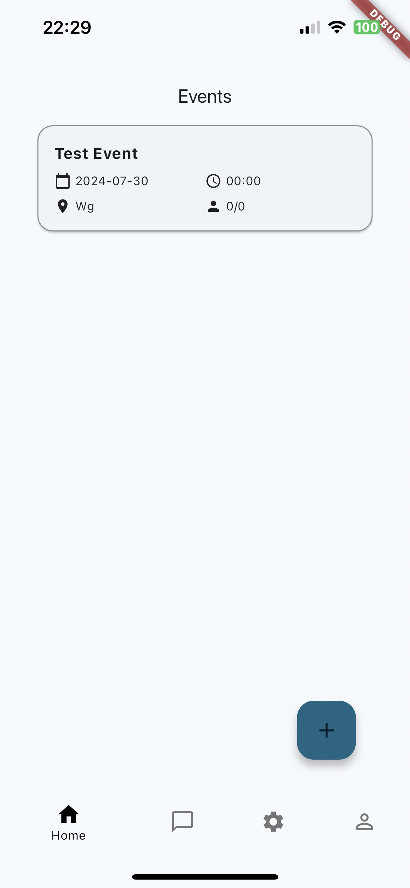
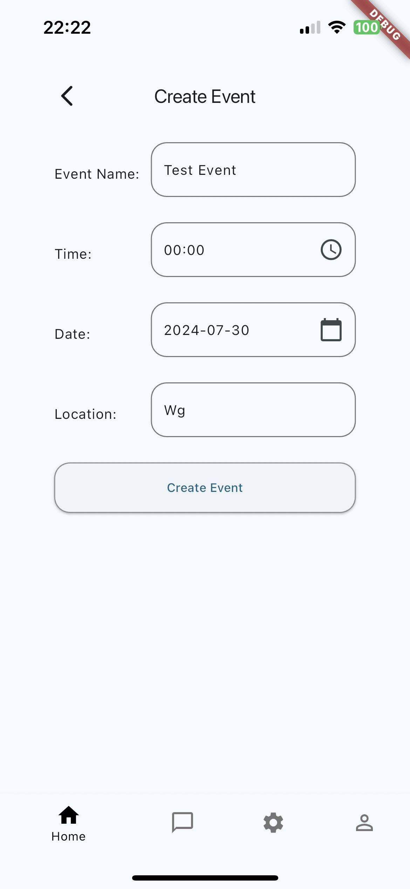
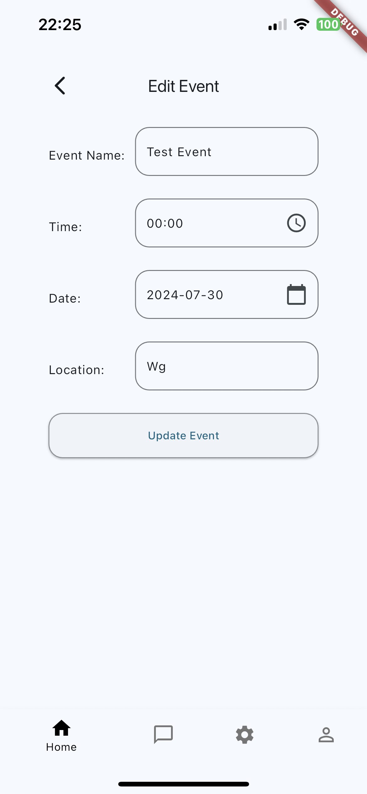
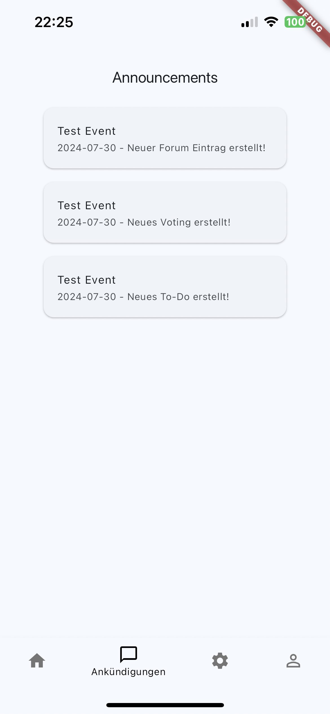
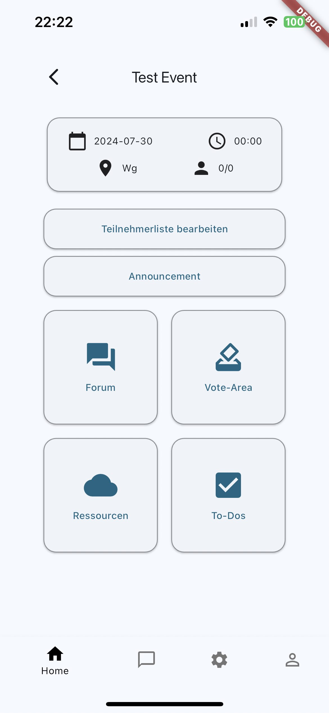
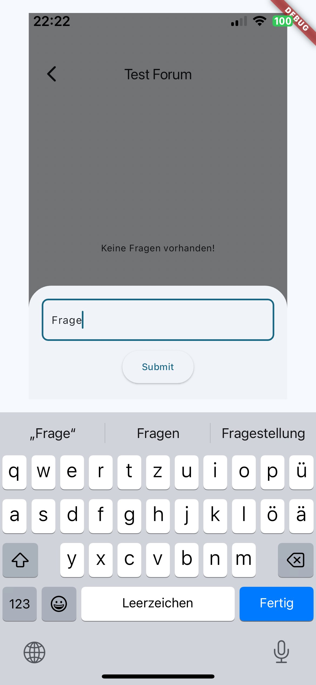
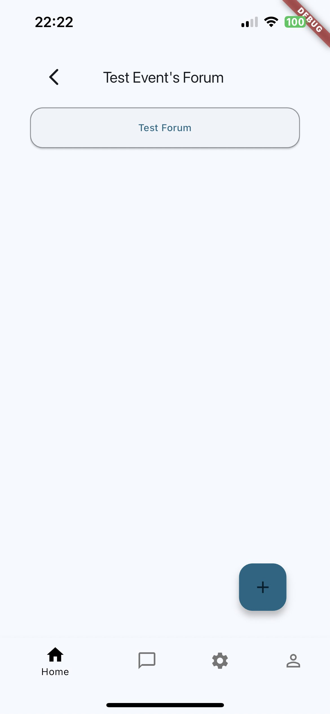
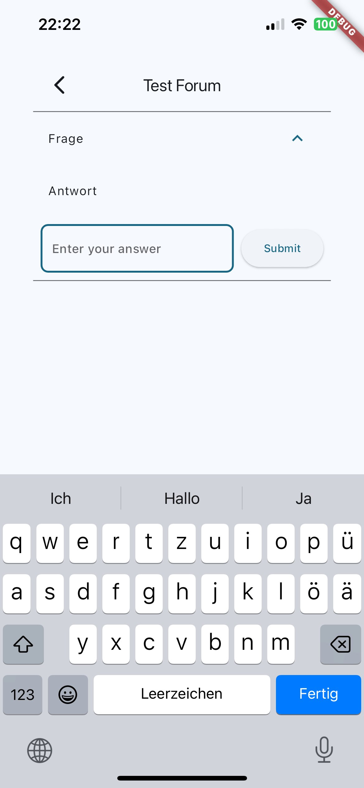

# EventFlow

This application provides the opportunity to plan activities or
events with your acquaintances, friends, or anyone else you 
want to organize something with. It allows you to do this better, 
more easily, more clearly, and with more fun.

Every time we want to plan an event, no matter what kind of event it is, 
we create a group chat and invite everyone we want to include. Then the joint planning begins. 
Various polls are created, and files are uploaded. Everyone has great ideas and wants to contribute in some way. 
While this sounds good in theory, it rarely happens in an organized or structured manner. 
It can become annoying and often someone loses their excitement for the planned event.

That's why we have the solution: EventFlow, an app where you can create an event and plan it together. 
The app offers various sections for this purpose:
Resources, Forum, To-Do List, and Vote Area.
## Personas Benefiting from EventFlow

EventFlow is designed to help a variety of users plan and organize events more efficiently and enjoyably.
Below are some personas who would greatly benefit from using our app:

1. **Marie Müller**

    - **Age**: 28 years
    - **Occupation**: Event Manager
    - **Attributes**:
        - **Organized**: Marie loves planning events and always has a clear overview of all the details.
        - **Communicative**: She is very talkative and has no problems communicating with many people at once.
        - **Tech-Savvy**: She enjoys using new technologies and apps to make her work more efficient.
    - **Usage**:
        - **Birthday Parties**: Marie uses EventFlow to plan her best friend's birthday. She creates polls for food selection and organizes a to-do list for the decorations.
        - **Class Reunions**: For the next class reunion, Marie creates a vote area in EventFlow to determine the best date and location for the event.
        - **Group Vacations**: When planning a group vacation with friends, Marie organizes all travel information and tasks in the resources section of EventFlow.

2. **Jonas Schmidt**

    - **Age**: 35 years
    - **Occupation**: Teacher
    - **Attributes**:
        - **Structured**: Jonas loves clear structures and processes and prefers well-organized workflows.
        - **Cooperative**: He enjoys working in a team and values the ideas and opinions of others.
        - **Patient**: Jonas has the patience to weigh different opinions and suggestions before making a decision.
    - **Usage**:
        - **Birthday Parties**: Jonas plans his daughter's birthday party and uses the to-do list in EventFlow to ensure nothing is forgotten.
        - **Class Reunions**: When organizing a class reunion, he uses the forum in EventFlow to ensure that all former classmates can share their ideas and suggestions.
        - **Group Vacations**: Jonas uses the resources section to centrally store all important travel documents and information, making them accessible to his travel group.

3. **Lisa Weber**

    - **Age**: 23 years
    - **Occupation**: Student
    - **Attributes**:
        - **Creative**: Lisa has many creative ideas and loves incorporating them into event planning.
        - **Sociable**: She is very social and enjoys spending time with friends and family.
        - **Flexible**: Lisa is adaptable and can quickly adjust to changes.
    - **Usage**:
        - **Birthday Parties**: Lisa organizes a surprise party for her best friend and uses EventFlow to invite all friends and distribute tasks.
        - **Class Reunions**: For the annual class reunion, Lisa creates creative polls in EventFlow to plan the program and activities.
        - **Group Vacations**: When planning a group vacation with her fellow students, Lisa uses the vote area to determine the best activities and excursions.

## Overview of App Screens

Below is a brief introduction to the screens of the app:

### Homescreen
The Homescreen displays all events, whether in the future or the past. There is also a button to create a new event.

[//]: # (![Homescreen]&#40;./grafik_screens/events_leer.jpg&#41;)

### Create Event Screen
The "Create Event" screen allows users to set up a new event by providing necessary details. Users can specify the event name, time, date, and location using the provided input fields. 
To create an event, users must fill in all these details accurately. Once all the information is entered, users can click the "Create Event" button to finalize and save their event.
The "Create event" screen is also available in a slightly modified version in which the events already created can be edited. The screen is then called "Edit Event"

### Announcement Screen
This screen shows all announcements, such as changes to the event time or new polls that require participation.

### Event Screen
This is the home screen for an individual event. You can see the event details and navigate to different sections.

The following screens are the sections of an event:

#### Forum Screen
In the Forum Screen, you can select an existing topic to enter the forum and communicate or create a new topic.

#### Vote-Area Screen
This screen displays all polls. You can select a poll to enter the voting screen and participate in the poll. You can also click the plus button to create a new poll with a question and answer options.

#### Resources Screen
Here you can upload files.

#### Todo Screen
This screen displays the existing todos, which you can check off or create new todos.

#### Create Announcement Screen
Here you can create announcements that will be visible to everyone on their personal announcement screens.

